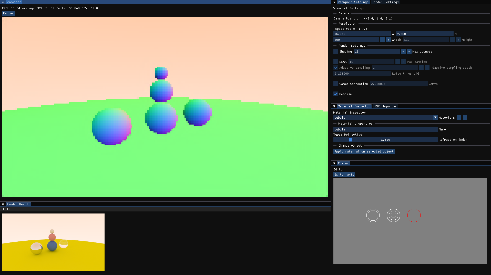
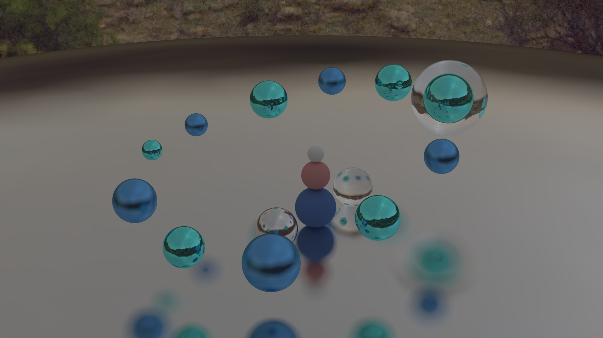

  

# Simple ray-tracer
3D program using my ray tracing engine based on the engine from the book [Ray Tracing in One Weekend](https://raytracing.github.io/books/RayTracingInOneWeekend.html). This program was written in a week for a school competition.

# Features 
<ol>
    <li>Real-time scene rendering in a viewport.</li>
    <li>Real-time progress preview of the final render.</li>
    <li>Three different material types which includes Lambertian, specular and refractive.</li>
    <li>Settings for how the scene should be rendered for both the viewport and the final render. This includes things like adaptive SSAA, max bounces, denoising etc.</li>
    <li>Material editor where you can create, edit, assign and remove materials.</li>
    <li>A 2D editor where you can add, remove, change position and rescale the spheres.</li>
    <li>HDRI support.</li>
    <li>Denoising render results using Intel® Open Image Denoise.</li>
</ol>

#### Limitations
<ol>
    <li>Can only render spheres.</li>
    <li>No hardware acceleration.</li>
    <li>Global lighting only.</li>
</ol>
There are of course other limitations as well, but these are the most serious in my opinion.

# Showcase

Example of software interface, the layout is customizeable.

 
 

High quality render showcasing the different material types and HDRI.

# Instructions for usage

### Startup
The default resolution of the program is 1920x1080, if you would like a different resolution you can resize the window freely. 
Once the program starts it loads a default scene that contains a few spheres (Shown in the software interface image).

### Editing the scene
You can edit the spheres in the scene inside of the 2D editor.
* <code>Right click</code> to add, remove or deselect the currently selected sphere.
* While a sphere is selected, hold <code>s</code> and <code>left click</code> to change the radius of the sphere.
* Hold <code>scroll wheel</code> to navigate the editor using your mouse.
* The <code>Switch axis</code> button switches between showing the X, Z and X, Y planes.

You can add materials in the material inspector. Note that materials that are assigned to an object cannot be removed.
To remove a material that is assigned to an amount of objects you need to assign a different material to each of those objects, then you can delete it.

HDRIs can be imported in the HDRI importer window. This is used as a background to add interesting reflections to the render.

### Viewport
The viewport is controlled similarly to a video game.
* Click inside of the viewport window to enable control.
* You can move around using <code>wasd</code> and <code>e</code> or <code>q</code> to move up and down.
* Hold <code>shift</code> while moving to increase the movement speed.
* Use the <code>scroll wheel</code> to change FOV (zoom).

### Performing a final render
When you feel like you are ready to do a final render or simply want to see a high quality preview of your scene, press the <code>Render</code> button located in the top left of the viewport.
This will begin rendering the scene on the same thread that is running the viewport, which means that the viewport will be temporarily frozen. To see the current progress, open the <code>Render Result</code> window.
When the render is finished and you are happy with the result, press <code>File</code> and <code>Save Image</code>.

#### **Slow render times**
When rendering, it's important that you are using logical and realistic settings. The default settings are for low resolution, medium quality results. It shouldn't take longer than half a minute to render a scene with these settings, even if you have a slower CPU. For perspective, it takes my i5-12600K around 8 seconds to render the default scene.

The render time is affected by every setting, but some of them significantly more. The resolution and SSAA settings are the biggest affectors, which is why it is highly recommended to use the adaptive sampling option.

**Adaptive sampling**
Supersampling Anti-Aliasing or SSAA is a technique used for calculating realistic approximations of light reflected on diffuse (lambertian) materials. This involves sampling multiple rays per pixel and getting the average color. The reason why this is used is because lambertian shading reflects incident light in a random direction (biased toward the normal). If we simply were to use one ray, the result is extremely noisy. You can see this for yourself in the viewport by enabling the <code>Shading</code> option and disabling the <code>Denoise</code> option. 

This technique comes at an expensive price though. This is because the amount of samples scales the work needed to be done linearly, which is why I added adaptive sampling. This will adjust the amount of samples needed for a pixel based on the color and luminance variance of all of the previously sampled rays.

**Options:**
* **Max samples**: Max samples is the maximum amount of a samples that can be sampled for a pixel.
* **Adaptive sampling depth**: This is the initial samples to get the approximate color and luminance variation of the current pixel. These samples will **always be used for the current pixel** which means that this value changes the render time drastically.
* **Noise threshold**: The noise threshold is a value for the **maximum allowed color variance** for the current pixel. If the color variance is bigger than the threshold, the number of samples will be incremented by one. This process continues until either the color variance is under the threshold or the <code>Max samples</code> value is reached.

# Libraries used
* [SDL2](https://github.com/libsdl-org/SDL) for graphics.
* [ImGui](https://github.com/ocornut/imgui) for the UI.
* [spdlog](https://github.com/gabime/spdlog) for logging.
* [stb](https://github.com/nothings/stb) for HDRI importing.
* [Intel® Open Image Denoise](https://github.com/RenderKit/oidn) for render denoising.

# Building
Note: Only supports x64 Windows

The RayTracer directory includes a Visual Studio 2022 solution.